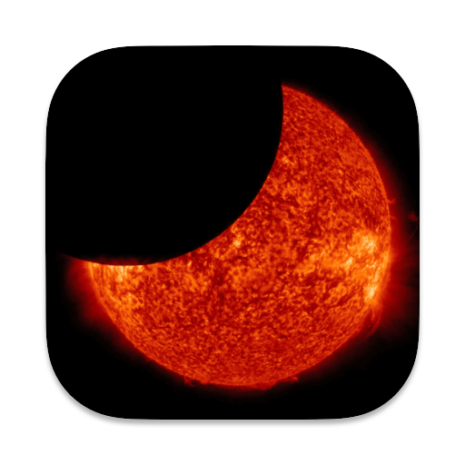

  

<h1 align="center">Solar Eclipse Prediction</h1>

  
  
  

Custom Home Assistant integration (HACS) that shows upcoming solar eclipses:

- **Skyfield ON** → precise local visibility (coverage %, local maximum time, contact estimates) at your coordinates; shows the next N locally visible eclipses.  
- **Skyfield OFF** → lists the next N eclipses for the “Geographic Region of Eclipse Visibility” (e.g., Europe, North America).

Primary data source: **NASA/GSFC decade catalogs** + optional local calculations via **Skyfield**.

---

## Requirements
- Home Assistant **2023.8+**
- Optional (for local astronomy mode):
  - `skyfield>=1.49`
  - `jplephem>=2.22`
  - `numpy>=1.26`

---

## Installation via HACS
1. Go to **HACS → Integrations → Custom repositories**.  
2. Add: `https://github.com/<your-user>/solar_eclipse` (select *Integration*).  
3. Install **Solar Eclipse Prediction**.  
4. Restart Home Assistant.  
5. Go to **Settings → Devices & Services → Add Integration** → search for **Solar Eclipse Prediction**.  

---

## Configuration
- **Skyfield mode**  
  - ON → asks for latitude/longitude (local visibility & coverage computed).  
  - OFF → asks for a “Geographic Region of Eclipse Visibility”.  
- **Number of eclipses** → integer 1–10 (default 3).  
- **Daily update time** → local hour in HH:MM format (minutes ignored).  
- Options can be reconfigured anytime without removing the entry.  

---

## Entities
- `sensor.eclipse_1_date … sensor.eclipse_N_date` (device class: `date`)  
  **Attributes (when available):**
  - `region`  
  - `type`  
  - `local_max_coverage_percent` (e.g., `"45.1%"`) [Skyfield ON]  
  - `start_time`, `maximum_time`, `end_time` (local time)  
  - `start`, `end` (UTC dataset times)  
  - `source`, `attribution`  
- `sensor.days_until_next_eclipse` (`mdi:calendar-end`)  
- `binary_sensor.eclipse_this_week` (`mdi:telescope`)  

---

## Behavior
- Refresh on load and daily at the configured local hour.  
- **Skyfield ON**:
  - Scans future NASA catalogs to find the next N eclipses with local coverage > 0% at your coordinates.  
  - Uses concurrency-limited Skyfield computations (lightweight; cached).  
- **Skyfield OFF**:
  - Filters by region (via NASA JSEX pages).  
  - Falls back to minimal embedded dataset if NASA is unreachable.  

---

## Icons, Branding, Translations
- MDI icons in UI.  
- `icon.png` used for repo/HACS preview.  
- Translations available: `en`, `it`, `es`, `fr`, `de`.  

---

## Troubleshooting
- **“Using minimal fallback list” in logs** → NASA catalog unreachable or changed. Check access to:  
  - `https://eclipse.gsfc.nasa.gov/SEdecade/`  
- **Unknown states** → if fewer than N eclipses are visible soon, some slots remain empty until future events are found.  

---

## Data Sources
- NASA/GSFC decade catalogs:  
  - https://eclipse.gsfc.nasa.gov/SEdecade/SEdecade2021.html  
  - https://eclipse.gsfc.nasa.gov/SEdecade/SEdecade2031.html  
  - https://eclipse.gsfc.nasa.gov/SEdecade/SEdecade2041.html  
- JSEX index (regional): https://eclipse.gsfc.nasa.gov/JSEX/JSEX-index.html  

---

## Credits
- **Data** → Eclipse predictions by NASA/GSFC  
- **Astronomy** → [Skyfield](https://rhodesmill.org/skyfield/)  
- **Author** → [@<your-user>](https://github.com/matteoconti92)  

---

## License
